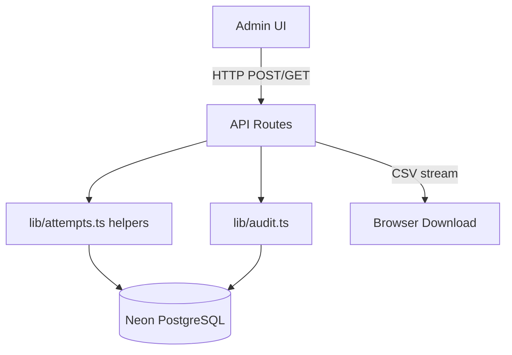

# Design Document: Admin Controls

## Overview

This feature adds four administrative control capabilities to the InternIQ system. Admins currently have read-only visibility into attempts and results. These controls give admins the ability to intervene in live attempts, correct scoring errors, retract published results, and export data for offline analysis.

The four capabilities are:
1. **Terminate attempt** — forcibly end an in-progress attempt
2. **Override score** — adjust the computed score of a finalized attempt
3. **Unpublish results** — revert a quiz's results from visible back to hidden
4. **Export results as CSV** — download all attempt data for a quiz

All mutating operations are recorded in a new `admin_audit_log` table for accountability.

---

## Architecture

The feature follows the existing Next.js App Router pattern used throughout the codebase:

- **API Routes** (`app/api/admin/...`) — server-side handlers that authenticate, validate, mutate the database, and write audit log entries
- **Server Components** — existing pages (`/admin/results`, `/admin/leaderboard`) are extended with new action buttons
- **Client Components** — interactive buttons that call the API routes and trigger `router.refresh()` for optimistic UI updates
- **`lib/attempts.ts`** — extended with `overrideScore` and `unpublishResults` helper functions, keeping business logic out of route handlers



The CSV export is a GET route that streams a `text/csv` response directly — no intermediate file storage needed.

---

## Components and Interfaces

### New API Routes

| Method | Path | Purpose |
|--------|------|---------|
| `POST` | `/api/admin/attempts/[attemptId]/terminate` | Terminate an in-progress attempt |
| `PATCH` | `/api/admin/attempts/[attemptId]/score` | Override a finalized attempt's score |
| `POST` | `/api/admin/quizzes/[quizId]/unpublish` | Unpublish results for a quiz |
| `GET` | `/api/admin/quizzes/[quizId]/export` | Download results as CSV |

### New Library Functions

**`lib/attempts.ts`** additions:

```typescript
/**
 * Admin-terminates an in-progress attempt.
 * Calls finalizeAttempt with reason="TERMINATED" then writes an audit log entry.
 */
export async function adminTerminateAttempt(
  attemptId: string,
  adminId: string,
  reason?: string
): Promise<FinalizeAttemptResult>

/**
 * Overrides the score of a finalized attempt.
 * Recomputes percentage and passed, updates rank if results are published.
 */
export async function overrideScore(
  attemptId: string,
  adminId: string,
  scoreOverride: number
): Promise<{ score: number; percentage: number; passed: boolean }>

/**
 * Unpublishes results for a quiz.
 * Sets resultsPublishedAt/By to NULL and clears all ranks.
 */
export async function unpublishResults(
  quizId: string,
  adminId: string
): Promise<void>
```

**`lib/audit.ts`** (new file):

```typescript
export type AuditAction =
  | "ADMIN_TERMINATED"
  | "SCORE_OVERRIDE"
  | "RESULTS_UNPUBLISHED"

export interface AuditLogEntry {
  id: string
  adminId: string
  action: AuditAction
  targetType: "attempt" | "quiz"
  targetId: string
  metadata: Record<string, unknown>
  createdAt: Date
}

/**
 * Inserts a row into admin_audit_log.
 */
export async function writeAuditLog(entry: Omit<AuditLogEntry, "id" | "createdAt">): Promise<void>
```

### New UI Components

| Component | Location | Purpose |
|-----------|----------|---------|
| `TerminateAttemptButton` | `app/admin/results/[attemptId]/terminate-button.tsx` | Confirm-dialog button on attempt detail page |
| `ScoreOverrideForm` | `app/admin/results/[attemptId]/score-override-form.tsx` | Inline form with number input on attempt detail page |
| `UnpublishResultsButton` | `app/admin/leaderboard/unpublish-results-button.tsx` | Confirm-dialog button on leaderboard page |
| `ExportCsvButton` | `app/admin/leaderboard/export-csv-button.tsx` | Download trigger on leaderboard and results pages |

All client components follow the existing pattern from `PublishResultsButton`: `"use client"`, `useRouter` + `router.refresh()`, `sonner` toasts for feedback, `AlertDialog` for destructive confirmations.

---

## Data Models

### New Table: `admin_audit_log`

```sql
CREATE TABLE admin_audit_log (
  id          TEXT        PRIMARY KEY DEFAULT gen_random_uuid(),
  "adminId"   TEXT        NOT NULL REFERENCES users(id),
  action      TEXT        NOT NULL,   -- 'ADMIN_TERMINATED' | 'SCORE_OVERRIDE' | 'RESULTS_UNPUBLISHED'
  "targetType" TEXT       NOT NULL,   -- 'attempt' | 'quiz'
  "targetId"  TEXT        NOT NULL,
  metadata    JSONB       NOT NULL DEFAULT '{}',
  "createdAt" TIMESTAMPTZ NOT NULL DEFAULT NOW()
);

CREATE INDEX idx_audit_log_target ON admin_audit_log ("targetType", "targetId");
CREATE INDEX idx_audit_log_admin  ON admin_audit_log ("adminId");
```

### Metadata Shapes per Action

**`ADMIN_TERMINATED`**
```json
{ "reason": "string | null" }
```

**`SCORE_OVERRIDE`**
```json
{ "previousScore": 42, "newScore": 50, "reason": "string | null" }
```

**`RESULTS_UNPUBLISHED`**
```json
{ "previousPublishedAt": "2025-01-15T10:30:00.000Z" }
```

### `quiz_attempts` — New Column

A `scoreOverriddenAt` timestamp column (nullable) is added to `quiz_attempts` to support the UI indicator for manually adjusted scores:

```sql
ALTER TABLE quiz_attempts ADD COLUMN "scoreOverriddenAt" TIMESTAMPTZ;
ALTER TABLE quiz_attempts ADD COLUMN "scoreOverriddenBy" TEXT REFERENCES users(id);
```

The attempt detail page checks `scoreOverriddenAt IS NOT NULL` to render the "manually adjusted" badge.

### CSV Export Schema

The exported CSV has these columns in order:

```
attempt_id, intern_name, intern_email, status, score, total_points,
percentage, passed, rank, violations, time_spent_seconds, started_at, submitted_at
```

Rows are ordered by `percentage DESC, time_spent_seconds ASC` (matching the leaderboard sort). Only finalized attempts (`status != 'IN_PROGRESS'`) are included.

---

## Correctness Properties

*A property is a characteristic or behavior that should hold true across all valid executions of a system — essentially, a formal statement about what the system should do. Properties serve as the bridge between human-readable specifications and machine-verifiable correctness guarantees.*

The project already has `fast-check` installed as a dev dependency and uses `vitest` as the test runner, so property-based tests will use `fast-check` with `vitest`.

### Property 1: Termination rejects non-IN_PROGRESS attempts

*For any* attempt whose status is `SUBMITTED`, `TIMED_OUT`, or `TERMINATED`, calling `adminTerminateAttempt` SHALL return a 409 error and leave the attempt row unchanged.

**Validates: Requirements 1.1, 1.5**

### Property 2: Termination produces correct final state

*For any* in-progress attempt, after `adminTerminateAttempt` completes, the attempt's status SHALL be `TERMINATED` and its score SHALL equal the sum of points for answers that were correct at the time of termination.

**Validates: Requirements 1.2**

### Property 3: Every admin action writes an audit log entry

*For any* successful termination, score override, or unpublish action, exactly one `admin_audit_log` row SHALL be created with the correct `adminId`, `targetId`, `action` type, and a `createdAt` within a few seconds of the action.

**Validates: Requirements 1.3, 2.4, 3.4, 5.2**

### Property 4: Termination reason is preserved in audit log

*For any* reason string (including null) passed to `adminTerminateAttempt`, the resulting audit log entry's `metadata.reason` SHALL equal that value exactly.

**Validates: Requirements 1.4, 5.4**

### Property 5: Score override percentage formula is correct

*For any* `scoreOverride` value in `[0, totalPoints]` and any `totalPoints > 0`, the recomputed `percentage` SHALL equal `Math.round((scoreOverride / totalPoints) * 1000) / 10` and `passed` SHALL equal `percentage >= passingScore`.

**Validates: Requirements 2.2**

### Property 6: Score override persists and is retrievable

*For any* valid `scoreOverride` applied to a finalized attempt, reading the attempt row afterwards SHALL return the new `score`, `percentage`, `passed`, and a non-null `scoreOverriddenAt`.

**Validates: Requirements 2.3, 2.10**

### Property 7: Score override on published quiz preserves rank ordering invariant

*For any* published quiz with multiple finalized attempts, after applying a score override to any one attempt, the ranks of all attempts SHALL be consistent with ordering by `percentage DESC, time_spent_seconds ASC` with no gaps or duplicates.

**Validates: Requirements 2.5**

### Property 8: Score override rejects out-of-range values

*For any* `scoreOverride` that is negative or exceeds `totalPoints`, the override SHALL be rejected with a 422 error and the attempt row SHALL remain unchanged.

**Validates: Requirements 2.1, 2.6**

### Property 9: Unpublish clears publication fields and all ranks

*For any* published quiz, after `unpublishResults` completes, the quiz row SHALL have `resultsPublishedAt = NULL` and `resultsPublishedBy = NULL`, and every finalized attempt for that quiz SHALL have `rank = NULL`.

**Validates: Requirements 3.2, 3.3**

### Property 10: Unpublish rejects already-unpublished quizzes

*For any* quiz with `resultsPublishedAt = NULL`, calling `unpublishResults` SHALL return a 409 error and leave the quiz row unchanged.

**Validates: Requirements 3.1, 3.5**

### Property 11: CSV export headers are always correct

*For any* quiz (with or without finalized attempts), the first line of the exported CSV SHALL contain exactly the 13 specified column headers in the correct order.

**Validates: Requirements 4.2**

### Property 12: CSV row count matches finalized attempt count

*For any* quiz with N finalized attempts, the exported CSV SHALL contain exactly N + 1 lines (1 header + N data rows), and the data rows SHALL be ordered by `percentage DESC, time_spent_seconds ASC`.

**Validates: Requirements 4.3, 4.4**

### Property 13: CSV escaping round-trips correctly

*For any* field value containing commas, double-quotes, or newline characters, the CSV-escaped representation SHALL be parseable by a standard CSV parser and produce the original value.

**Validates: Requirements 4.8**

### Property 14: All admin endpoints reject non-admin users

*For any* request to the terminate, score-override, unpublish, or export endpoints made by a user with `role != 'ADMIN'` (or with no session), the response SHALL be 401 Unauthorized.

**Validates: Requirements 1.8, 2.9, 3.9, 4.6**

### Property 15: Audit log metadata structure is correct per action type

*For any* `SCORE_OVERRIDE` audit log entry, `metadata` SHALL contain `previousScore` and `newScore` keys. *For any* `ADMIN_TERMINATED` entry, `metadata` SHALL contain a `reason` key. *For any* `RESULTS_UNPUBLISHED` entry, `metadata` SHALL contain a `previousPublishedAt` key.

**Validates: Requirements 5.3, 5.4, 5.5**

---

## Error Handling

### HTTP Status Codes

| Condition | Status |
|-----------|--------|
| Unauthenticated or non-admin caller | 401 Unauthorized |
| Attempt or quiz not found | 404 Not Found |
| Attempt already finalized (terminate) | 409 Conflict |
| Quiz already unpublished (unpublish) | 409 Conflict |
| Attempt is IN_PROGRESS (score override) | 409 Conflict |
| scoreOverride out of range | 422 Unprocessable Entity |
| Unexpected server error | 500 Internal Server Error |

### Error Response Shape

All error responses follow the existing convention:

```json
{ "error": "Descriptive message here" }
```

### Transactional Safety

Score override and unpublish both involve multiple SQL statements (update attempt + update ranks, or update quiz + clear ranks). These are wrapped in a single transaction to prevent partial updates. The Neon serverless driver supports transactions via `sql.transaction([...])`.

### Audit Log Failures

Audit log writes happen after the primary mutation succeeds. If the audit log write fails, the error is logged server-side but does not roll back the primary action — the mutation is more important than the audit record. This is a deliberate tradeoff to avoid blocking admin operations on audit infrastructure failures.

---

## Testing Strategy

### Unit Tests (vitest)

- `lib/audit.ts` — `writeAuditLog` with a mocked `sql` driver
- `lib/attempts.ts` — `overrideScore` percentage formula with concrete examples
- CSV escaping utility — specific examples: empty string, string with comma, string with double-quote, string with newline, string with all three
- `adminTerminateAttempt` — verify it calls `finalizeAttempt` with `reason="TERMINATED"` (mock `finalizeAttempt`)

### Property-Based Tests (fast-check + vitest)

Each property test runs a minimum of 100 iterations. Tests are tagged with a comment referencing the design property.

**Feature: admin-controls, Property 5: Score override percentage formula is correct**
- Generator: `fc.tuple(fc.integer({ min: 0, max: 1000 }), fc.integer({ min: 1, max: 1000 }), fc.integer({ min: 0, max: 100 }))` producing `[scoreOverride, totalPoints, passingScore]` where `scoreOverride <= totalPoints`
- Assert: `percentage === Math.round((scoreOverride / totalPoints) * 1000) / 10` and `passed === (percentage >= passingScore)`

**Feature: admin-controls, Property 8: Score override rejects out-of-range values**
- Generator: `fc.integer({ max: -1 })` (negative) and `fc.tuple(fc.integer({ min: 0 }), fc.integer({ min: 0 }))` filtered to `scoreOverride > totalPoints`
- Assert: validation function returns an error for both cases

**Feature: admin-controls, Property 13: CSV escaping round-trips correctly**
- Generator: `fc.string()` (arbitrary strings including special characters)
- Assert: `csvParse(csvEscape(value))[0][0] === value`

**Feature: admin-controls, Property 12: CSV row count matches finalized attempt count**
- Generator: array of mock attempt objects with varying statuses
- Assert: CSV line count equals `finalized.length + 1`

**Feature: admin-controls, Property 15: Audit log metadata structure is correct per action type**
- Generator: random `previousScore`, `newScore`, `reason`, `previousPublishedAt` values
- Assert: metadata objects contain the required keys for each action type

### Integration Tests

- `POST /api/admin/attempts/[attemptId]/terminate` — happy path with a real DB fixture; verify status=TERMINATED and audit log row
- `PATCH /api/admin/attempts/[attemptId]/score` — happy path; verify score/percentage/passed updated and audit log row
- `POST /api/admin/quizzes/[quizId]/unpublish` — happy path; verify resultsPublishedAt=NULL, ranks cleared, audit log row
- `GET /api/admin/quizzes/[quizId]/export` — verify Content-Type header and CSV structure

### Smoke Tests

- Verify `admin_audit_log` table exists with the correct schema after migration
