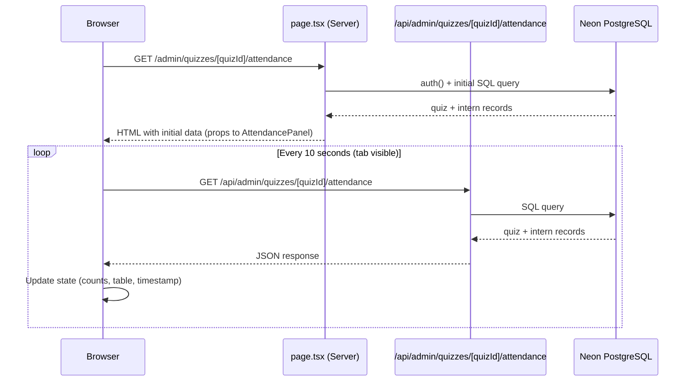

# Design Document: Attendance View

## Overview

The Attendance View is a real-time monitoring panel that lets admins observe intern participation during a live quiz exam window. It is scoped entirely to the admin panel and is accessed per-quiz at `/admin/quizzes/[quizId]/attendance`.

The feature consists of three layers:

1. **API route** — `GET /api/admin/quizzes/[quizId]/attendance` — queries Neon PostgreSQL via raw SQL and returns a JSON payload with quiz metadata and per-intern attendance records.
2. **Server component** — `app/admin/quizzes/[quizId]/attendance/page.tsx` — authenticates the admin, fetches the initial data server-side, and passes it to the client component.
3. **Client component** — `app/admin/quizzes/[quizId]/attendance/attendance-panel.tsx` — renders the UI, drives polling via `useEffect` + `setInterval`, and respects the Page Visibility API.

The design follows the established pattern in this codebase: server component for initial load + auth guard, client component for interactivity, raw `sql` tagged template literals for all DB access, `shadcn/ui` + `lucide-react` for UI, `date-fns` for time formatting, and `sonner` for error toasts.

---

## Architecture



The server component handles the first paint with zero loading state. The client component takes over for all subsequent updates. This avoids a flash of empty content and keeps the initial render fast.

---

## Components and Interfaces

### API Response Shape

```typescript
// GET /api/admin/quizzes/[quizId]/attendance
interface AttendanceResponse {
  quiz: {
    id: string
    title: string
    timeLimitMinutes: number
    // startAt/endAt come from assignments — we use the most common window
    // (all assignments for a quiz share the same window in practice)
    startAt: string | null   // ISO 8601
    endAt: string | null     // ISO 8601
  }
  interns: AttendanceRecord[]
  fetchedAt: string          // ISO 8601 — server timestamp for "last updated"
}

type AttendanceStatus = 'NOT_JOINED' | 'IN_PROGRESS' | 'COMPLETED'

interface AttendanceRecord {
  internId: string
  internName: string
  internEmail: string
  status: AttendanceStatus
  joinedAt: string | null    // ISO 8601
  startedAt: string | null   // ISO 8601 — from quiz_attempts.startedAt
  attemptStatus: string | null  // raw AttemptStatus from DB, null if no attempt
  violations: number
}
```

### Window Status Computation

A pure function derived from the quiz's `startAt`/`endAt` and the current time:

```typescript
type WindowStatus = 'UPCOMING' | 'OPEN' | 'CLOSED' | 'NO_WINDOW_SET'

function getWindowStatus(
  startAt: string | null,
  endAt: string | null,
  now: Date = new Date()
): WindowStatus {
  if (!startAt || !endAt) return 'NO_WINDOW_SET'
  const start = new Date(startAt)
  const end = new Date(endAt)
  if (now < start) return 'UPCOMING'
  if (now > end) return 'CLOSED'
  return 'OPEN'
}
```

### Intern Status Classification

A pure function that maps a DB row to an `AttendanceStatus`:

```typescript
function classifyIntern(row: {
  joinedAt: string | null
  attemptStatus: string | null
}): AttendanceStatus {
  if (!row.joinedAt) return 'NOT_JOINED'
  if (row.attemptStatus === 'IN_PROGRESS') return 'IN_PROGRESS'
  // SUBMITTED | TIMED_OUT | TERMINATED
  return 'COMPLETED'
}
```

### Summary Computation

```typescript
interface AttendanceSummary {
  total: number
  inProgress: number
  notJoined: number
  completed: number
  joined: number       // inProgress + completed
  joinRate: number     // round((joined / total) * 100), 0 if total === 0
}

function computeSummary(interns: AttendanceRecord[]): AttendanceSummary {
  const inProgress = interns.filter(i => i.status === 'IN_PROGRESS').length
  const notJoined  = interns.filter(i => i.status === 'NOT_JOINED').length
  const completed  = interns.filter(i => i.status === 'COMPLETED').length
  const total      = interns.length
  const joined     = inProgress + completed
  const joinRate   = total > 0 ? Math.round((joined / total) * 100) : 0
  return { total, inProgress, notJoined, completed, joined, joinRate }
}
```

### Elapsed Time Display

For `IN_PROGRESS` interns, elapsed time is computed client-side from `startedAt`:

```typescript
function formatElapsed(startedAt: string): string {
  const seconds = differenceInSeconds(new Date(), new Date(startedAt))
  const m = Math.floor(seconds / 60)
  const s = seconds % 60
  return `${m}m ${s}s`
}
```

### Polling Hook (inside AttendancePanel)

```typescript
// Inside AttendancePanel — useEffect drives polling
useEffect(() => {
  const controller = new AbortController()

  async function fetchData() {
    try {
      const res = await fetch(`/api/admin/quizzes/${quizId}/attendance`, {
        signal: controller.signal,
      })
      if (!res.ok) throw new Error(`HTTP ${res.status}`)
      const data: AttendanceResponse = await res.json()
      setData(data)
      setLastUpdated(new Date())
      setError(null)
    } catch (err) {
      if ((err as Error).name !== 'AbortError') {
        setError('Failed to refresh attendance data')
      }
    }
  }

  // Page Visibility API — pause when hidden, resume when visible
  function handleVisibilityChange() {
    if (document.visibilityState === 'visible') {
      fetchData()                          // immediate fetch on resume
      intervalRef.current = setInterval(fetchData, 10_000)
    } else {
      clearInterval(intervalRef.current)
    }
  }

  document.addEventListener('visibilitychange', handleVisibilityChange)
  intervalRef.current = setInterval(fetchData, 10_000)

  return () => {
    controller.abort()
    clearInterval(intervalRef.current)
    document.removeEventListener('visibilitychange', handleVisibilityChange)
  }
}, [quizId])
```

---

## Data Models

### SQL Query (Attendance API)

The API executes a single JOIN query to retrieve all assigned interns and their attempt data in one round-trip:

```sql
SELECT
  u.id             AS "internId",
  u.name           AS "internName",
  u.email          AS "internEmail",
  qa."joinedAt",
  at.status        AS "attemptStatus",
  at."startedAt",
  COALESCE(at.violations, 0) AS violations
FROM quiz_assignments qa
JOIN users u ON u.id = qa."internId"
LEFT JOIN quiz_attempts at
  ON at."internId" = qa."internId"
  AND at."quizId"  = qa."quizId"
WHERE qa."quizId" = ${quizId}
ORDER BY
  CASE
    WHEN at.status = 'IN_PROGRESS' THEN 1
    WHEN qa."joinedAt" IS NULL     THEN 2
    ELSE 3
  END,
  u.name ASC
```

The quiz metadata (title, timeLimitMinutes, startAt, endAt) is fetched in a separate query:

```sql
SELECT
  q.id,
  q.title,
  q."timeLimitMinutes",
  MIN(qa."startAt") AS "startAt",
  MAX(qa."endAt")   AS "endAt"
FROM quizzes q
LEFT JOIN quiz_assignments qa ON qa."quizId" = q.id
WHERE q.id = ${quizId}
GROUP BY q.id, q.title, q."timeLimitMinutes"
```

`MIN(startAt)` / `MAX(endAt)` gives a representative window. In practice all assignments for a quiz share the same window, so this is equivalent to taking any single row's values.

### State Shape (AttendancePanel)

```typescript
interface PanelState {
  data: AttendanceResponse | null
  lastUpdated: Date | null
  error: string | null
  filter: 'ALL' | 'IN_PROGRESS' | 'NOT_JOINED' | 'COMPLETED'
  isPolling: boolean
}
```

---

## Correctness Properties

*A property is a characteristic or behavior that should hold true across all valid executions of a system — essentially, a formal statement about what the system should do. Properties serve as the bridge between human-readable specifications and machine-verifiable correctness guarantees.*

### Property 1: Intern status is always one of three valid values

*For any* combination of `joinedAt` (null or non-null) and `attemptStatus` (null, IN_PROGRESS, SUBMITTED, TIMED_OUT, TERMINATED), the `classifyIntern` function SHALL return exactly one of `NOT_JOINED`, `IN_PROGRESS`, or `COMPLETED`.

**Validates: Requirements 2.1, 2.2, 2.3, 2.4, 2.5**

### Property 2: Intern record contains all required fields

*For any* quiz with any number of assigned interns (including zero), every element of the `interns` array returned by the Attendance API SHALL contain all required fields: `internId`, `internName`, `internEmail`, `status`, `joinedAt`, `startedAt`, `violations`, and `attemptStatus`.

**Validates: Requirements 3.5**

### Property 3: Intern records are sorted by status priority then alphabetically

*For any* list of intern records returned by the Attendance API, the list SHALL be ordered such that all `IN_PROGRESS` records appear before all `NOT_JOINED` records, which appear before all `COMPLETED` records, and within each group records are sorted alphabetically by `internName`.

**Validates: Requirements 3.6**

### Property 4: Summary counts are consistent with the intern records

*For any* array of `AttendanceRecord` objects, the `computeSummary` function SHALL produce counts where: `total` equals the array length, `notJoined` equals the count of records with status `NOT_JOINED`, `inProgress` equals the count with `IN_PROGRESS`, `completed` equals the count with `COMPLETED`, and `joined` equals `inProgress + completed`.

**Validates: Requirements 5.1, 5.2**

### Property 5: Join rate is correctly computed

*For any* non-empty array of intern records, the `joinRate` in the summary SHALL equal `Math.round((joined / total) * 100)`, and for an empty array it SHALL equal `0`.

**Validates: Requirements 5.3**

### Property 6: Elapsed time is always non-negative

*For any* `startedAt` timestamp that is in the past or equal to now, the `formatElapsed` function SHALL return a string representing a non-negative duration.

**Validates: Requirements 6.3**

### Property 7: Status filter returns only matching records

*For any* array of intern records and any filter value (`IN_PROGRESS`, `NOT_JOINED`, or `COMPLETED`), the filtered result SHALL contain only records whose `status` matches the filter value, and the `ALL` filter SHALL return all records unchanged.

**Validates: Requirements 6.5**

### Property 8: Window status is correctly classified for all timestamp combinations

*For any* triple of (`startAt`, `endAt`, `now`) where both `startAt` and `endAt` are non-null, the `getWindowStatus` function SHALL return `UPCOMING` when `now < startAt`, `OPEN` when `startAt ≤ now ≤ endAt`, and `CLOSED` when `now > endAt`. When either `startAt` or `endAt` is null, it SHALL return `NO_WINDOW_SET`.

**Validates: Requirements 7.1, 7.2**

---

## Error Handling

| Scenario | Behavior |
|---|---|
| Unauthenticated request to API | Return `401 Unauthorized` |
| Non-admin role request to API | Return `401 Unauthorized` |
| Quiz not found (invalid quizId) | Return `404 Not Found` with `{ error: "Quiz not found" }` |
| DB query failure | Return `500 Internal Server Error`; log error server-side |
| Polling fetch fails (network error) | Retain previous data; set `error` state; display error indicator in UI; do not clear the attendance grid |
| Polling fetch returns non-2xx | Same as network error above |
| AbortError on unmount | Silently ignored (expected cleanup) |
| Page navigated away | `useEffect` cleanup clears interval and aborts in-flight fetch |

The client component never clears the attendance grid on error — it shows a small error banner alongside the stale data so the admin retains visibility.

---

## Testing Strategy

### Unit Tests (example-based)

- `classifyIntern`: all five input combinations (null joinedAt, IN_PROGRESS, SUBMITTED, TIMED_OUT, TERMINATED)
- `getWindowStatus`: UPCOMING, OPEN, CLOSED, NO_WINDOW_SET cases
- `computeSummary`: empty array, all-same-status array, mixed array
- `formatElapsed`: known durations (e.g., 65 seconds → "1m 5s")
- API route: 401 for unauthenticated, 401 for intern role, 404 for unknown quizId, 200 with correct shape for valid request
- Filter logic: each filter value returns only matching records; ALL returns everything

### Property-Based Tests

Property-based testing is appropriate here because the core logic consists of pure classification and computation functions whose correctness must hold across all valid inputs. The project should use **fast-check** (the standard PBT library for TypeScript/JavaScript).

Each property test runs a minimum of **100 iterations**.

Tag format: `// Feature: attendance-view, Property N: <property text>`

**Property 1 — Intern status exhaustiveness**
```
// Feature: attendance-view, Property 1: intern status is always one of three valid values
fc.assert(fc.property(
  fc.record({
    joinedAt: fc.option(fc.date().map(d => d.toISOString()), { nil: null }),
    attemptStatus: fc.option(
      fc.constantFrom('IN_PROGRESS', 'SUBMITTED', 'TIMED_OUT', 'TERMINATED'),
      { nil: null }
    ),
  }),
  (row) => {
    const status = classifyIntern(row)
    return ['NOT_JOINED', 'IN_PROGRESS', 'COMPLETED'].includes(status)
  }
), { numRuns: 100 })
```

**Property 2 — Intern record fields**
Generate random intern/attempt data, pass through the API response formatter, verify all required fields are present on every record.

**Property 3 — Sort order invariant**
Generate random arrays of `AttendanceRecord` objects with mixed statuses and names, apply the sort, verify the ordering invariant holds.

**Property 4 — Summary consistency**
Generate random arrays of `AttendanceRecord` objects, compute summary, verify all count invariants.

**Property 5 — Join rate formula**
Generate random `(joined: number, total: number)` pairs where `total > 0` and `0 ≤ joined ≤ total`, verify `joinRate === Math.round((joined / total) * 100)`.

**Property 6 — Elapsed time non-negative**
Generate random past timestamps, verify `formatElapsed` returns a string representing ≥ 0 seconds.

**Property 7 — Filter correctness**
Generate random arrays of `AttendanceRecord` objects and random filter values, verify filtered results contain only matching records.

**Property 8 — Window status classification**
Generate random `(startAt, endAt, now)` triples (including null cases), verify `getWindowStatus` returns the correct status for each combination.

### Integration Tests

- End-to-end: seed a quiz with assignments and attempts in a test DB, call the API, verify the full response shape and sort order.
- Auth guard: verify the page redirects unauthenticated and intern-role users.

### Not Tested (by automated tests)

- Visual styling of status badges (amber/yellow/green/red) — manual/visual review
- Pulsing dot animation — manual/visual review
- Polling interval timing — manual/integration testing
- Page Visibility API behavior — manual testing in browser
